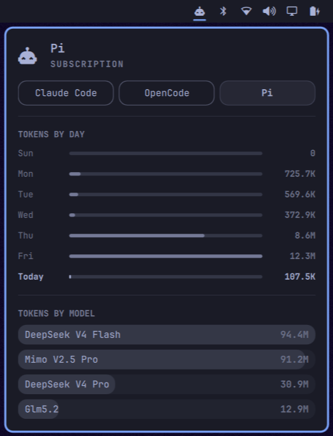

# omarchy-agent-collectors

Extensible usage collectors for AI coding agents on [Omarchy](https://omarchy.org).

<p align="center">
  
</p>

One engine, many drop-in adapters. Writes stock-contract records into
`~/.local/state/omarchy/agents/usage/`, where Omarchy's built-in
`omarchy.agents` bar panel picks them up automatically — no UI code involved.

Out of the box: **Pi** (`~/.pi/agent/sessions`) and **OpenCode**
(`~/.local/share/opencode/opencode.db`). Anything else is one manifest away.

## Install

```bash
omarchy plugin add https://github.com/rohaquinlop/omarchy-agent-collectors.git --enable
```

The service runs the engine at shell start and every 15 minutes. Records for
every detected agent appear within seconds; the Agents panel grows a chip per
agent (`h`/`l` to switch).

To fully uninstall:

```bash
omarchy plugin remove rohaquinlop.agent-collectors
rm -f ~/.local/state/omarchy/agents/usage/pi.json \
      ~/.local/state/omarchy/agents/usage/opencode.json
rm -rf ~/.cache/omarchy/agent-collectors
```

## How it works

```
adapters/<id>/manifest.json   declarative source + field map ┐
~/.config/omarchy/agent-collectors/adapters/<id>/…           ├→ engine → ~/.local/state/omarchy/agents/usage/<id>.json
(optional) collect/limits hooks                              ┘
```

Per run the engine:

1. Discovers adapters — built-in `adapters/`, then the user dir (same id = user wins).
2. Filters: skips an id when an official `omarchy-agent-usage-<id>` collector
   exists (superseded), when disabled via widget settings, or when its
   `detect` paths are missing.
3. Collects canonical events `{ts, session, model, kind, input, output, cacheRead, cacheWrite}`.
4. Aggregates today / last-7-days / all-time / per-model token buckets.
5. Writes `<id>.json` atomically (temp + rename, mode 600). One failing adapter never blocks others.

State (per-file parse caches) lives in `~/.cache/omarchy/agent-collectors/state.json`;
unchanged sources are not re-parsed. Delete it (or pass `--force`) for a full rescan.

### CLI

```bash
~/.config/omarchy/plugins/rohaquinlop.agent-collectors/bin/agent-collectors --validate   # list adapters
... --force                       # full rescan
... pi                            # only this adapter
... --except opencode             # everything but
```

## Widget settings honored

If you disable a provider in the Agents widget settings
(`providers.<id>.enabled: false` under the `omarchy.agents` bar entry), the
engine stops writing its record and the panel drops the tab.

## Writing an adapter

Create `~/.config/omarchy/agent-collectors/adapters/<id>/manifest.json`:

```json
{
  "schemaVersion": 1,
  "id": "gemini",
  "name": "Gemini",
  "detect": [{ "path": "~/.gemini" }],
  "sources": [{
    "format": "jsonl-lines",
    "glob": "~/.gemini/tmp/**/*.chats.json",
    "kindPath": "type", "kinds": ["message"],
    "rolePath": "message.role", "promptRole": "user", "completionRole": "assistant",
    "timestampPath": "timestamp", "modelPath": "message.model",
    "tokens": { "input": "message.usage.input", "output": "message.usage.output" }
  }]
}
```

- Formats: `jsonl-lines` (glob + per-line field map) or `sqlite-query`
  (read-only database + query + column map; `timestampUnit: "ms"` if needed).
- Dot paths index nested JSON (`message.usage.input`).
- Prompts are events whose role matches `promptRole`; completions match
  `completionRole` and carry tokens.
- `sessionIdPath` optional — defaults to the file stem (one session per file).

For anything the field map can't express, ship executables next to the
manifest and reference them:

```json
{ "collect": "collect.sh", "limits": "limits.sh" }
```

- `collect` prints one canonical-event JSON object per line on stdout.
- `limits` prints a limits-array JSON on stdout; exit 1 means "no data", not failure.
- Both run with the adapter directory as cwd; `FORCE=1` is set on forced runs.

Validate your setup with `bin/agent-collectors --validate`. A broken adapter
is skipped with a warning; it can never take other agents down.

## Resource bounds

The engine keeps memory and persistent state bounded by caps, never by
history size.

- State holds per-file append cursors and per-adapter counters only; event
  lists are never stored or re-read.
- Collectors yield events one at a time into the accumulator; per-run memory
  is proportional to one event plus one line/row buffer, never to history
  size. First runs and migrations parse the full history without
  materializing it.
- JSONL files are read append-only from the last byte offset; a truncated or
  rotated file triggers a full rescan, and a head fingerprint forces a full
  rescan when a file was replaced and regrown. A straddle line left by a
  crash-interrupted append is re-attached and parsed once. A mid-file rewrite
  that keeps the head and grows the file is not detected (JSONL session logs
  are append-only in practice).
- SQLite reads stream row by row; with a `ts` column only rows at or after the
  last seen timestamp are fetched, and rows sharing that boundary timestamp
  are deduplicated by fingerprint (adapter queries SHOULD `ORDER BY` the
  timestamp column).
- Hook stdout is streamed and capped: 100,000 lines and 1 MiB of buffering
  for `collect`, 1 MiB for `limits`; hook stderr is capped at 1 MiB. A hook
  that exceeds a cap is killed and its partial events are kept; other
  adapters are unaffected. A hook that daemonizes cannot hang the engine
  (bounded join).
- Hooks are stateless: they may re-emit their full history. The engine
  deduplicates hook events by fingerprint (50,000 per adapter); the same
  event is never counted twice.
- The service streams engine stderr line by line with a 1 MiB cap instead of
  buffering it to process end; the cap resets and the parser re-attaches on
  every run.
- Session ids: the newest 10,000 are kept per adapter; beyond that
  `totalSessions` is the stored count plus the evicted count (approximate).
- Model buckets: 50 per adapter; further models roll into `other`.
- Active dates: 730 days are kept; older ones still count toward `activeDays`.
- A state file larger than 64 MiB is ignored and rebuilt by a one-time full
  rescan. This also migrates older state layouts (v1/v2): totals are rebuilt
  from the session files, so no history is lost unless the files are gone.
- Adapter runs are staged: if an adapter fails mid-run, its counters and
  cursors commit nothing, so repeated failures never change totals.
- Crash window: state is saved before each adapter's record. A crash in
  between can double-count that adapter's appended bytes on the next run.
  The sqlite `>=` boundary and hook fingerprints bound the same issue for
  those sources.

## Notes

- Rate-limit meters only appear for adapters with a working `limits` hook;
  Pi has no usage endpoint, so its tab shows local stats only.
- The stock panel resolves provider icons from its own read-only assets
  directory; unknown agents render the standard bar glyph unless/until
  marks land upstream.
- Tests: `python3 -m unittest discover -s tests`.

## Token fields

Canonical events and the panel's per-model hover carry four token counters:

| Field | Meaning | Billing |
|---|---|---|
| `input` / `output` | Prompt tokens sent and completion tokens generated on this request | Standard rates |
| `cacheRead` | Prompt tokens served from the provider's server-side context cache instead of being re-processed | Discounted (~10% of input rate on Anthropic-style APIs) |
| `cacheWrite` | New prompt tokens written into that cache so later requests can read them | Premium (~125% of input rate on Anthropic-style APIs) |

Typical pattern: the first turn of a session writes most of the context to the
cache; follow-up turns read it back and only write each turn's new tail.

Providers without a billed prompt cache (MiMo, DeepSeek, and other OpenCode zen
models at the moment) report `cacheWrite: 0`, so a zero there means "not
offered by this model", not "nothing happened".

## License

MIT
